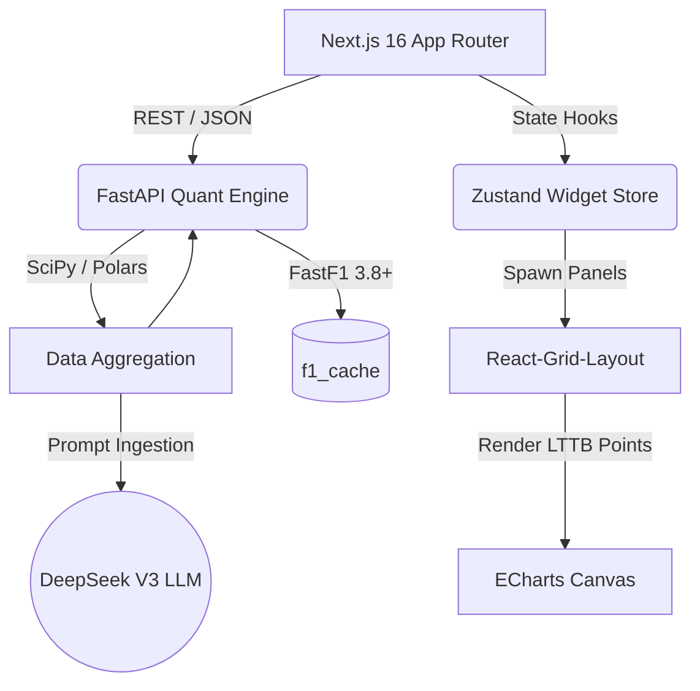

<div align="center">

# `[ F1 TERMINAL ]` — 完整技术文档

```text
  ___ ___   _____ ___ ___ __  __ ___ _  _  _   _    
 | __< _/  |_   _| __| _ \  \/  |_ _| \| |/ \ | |   
 | _|| |     | | | _||   / |\/| || || .` / _ \| |__ 
 |_| |_|     |_| |___|_|_\_|  |_|___|_|\_/_/ \_\____|
```

**The Bloomberg Terminal for Formula 1.**  
*Version 1.0 | Last Updated: 2026-03-01*

</div>

---

## 目录 (Table of Contents)

1. [项目概述](#1-项目概述)
2. [技术架构](#2-技术架构)
3. [代码目录结构](#3-代码目录结构)
4. [CLI 指令完整手册](#4-cli-指令完整手册)
5. [指令使用教学](#5-指令使用教学)
6. [后端 API 端点参考](#6-后端-api-端点参考)
7. [数据流管线](#7-数据流管线)
8. [本地开发指南](#8-本地开发指南)
9. [生产部署指南](#9-生产部署指南)
10. [常见问题排查](#10-常见问题排查)

---

## 1. 项目概述

F1 Terminal 是一个高密度、键盘驱动的 Formula 1 数据分析平台，对标彭博金融终端的交互范式。核心设计哲学：

- **键盘优先 (Keyboard-First)**：所有数据检索通过 CLI 指令触发，无需鼠标点击导航
- **量化精准 (Quant-Level)**：所有对比分析基于 SciPy 距离轴插值对齐，杜绝时间轴直接比较的误差
- **零全局状态 (Zero Global State)**：每条 CLI 指令生成独立的 React Widget，互不干扰，可自由拖拽排列
- **暗黑终端美学 (Dark Terminal Aesthetic)**：#050505 纯黑背景，荧光绿/法拉利红/迈凯伦橙高对比度配色

---

## 2. 技术架构



### 技术栈

| 层级 | 技术 | 版本 | 用途 |
|:---|:---|:---|:---|
| **前端框架** | Next.js (App Router) | 16.1.6 | SSR + 客户端路由 |
| **UI 渲染** | React | 19.2.3 | 组件化 UI |
| **状态管理** | Zustand | 5.0.11 | 轻量级 Widget 状态 |
| **图表引擎** | ECharts | 6.0.0 | Canvas 高性能渲染 |
| **布局系统** | React-Grid-Layout | 2.2.2 | 可拖拽面板 |
| **样式** | Tailwind CSS | 4.2.1 | 暗黑终端样式 |
| **图标库** | Lucide React | 0.575.0 | 系统图标 |
| **后端框架** | FastAPI | latest | 异步 REST API |
| **F1 数据源** | FastF1 | latest | FIA 官方遥测缓存 |
| **数据清洗** | Polars / Pandas | latest | 高频数据帧操作 |
| **数学计算** | NumPy / SciPy | latest | 插值、导数、回归 |
| **AI 引擎** | DeepSeek V3 (via OpenAI SDK) | latest | 赛事策略研报生成 |

---

## 3. 代码目录结构

```
LapLens/                              # 项目根目录 (Monorepo)
├── docker-compose.yml                # Docker 编排 (生产部署)
├── .env.production                   # 生产环境变量模板
├── README.md                         # 项目介绍
├── CONTRIBUTING.md                   # 贡献指南
│
├── frontend/                         # ====== 前端 (Next.js) ======
│   ├── Dockerfile                    # 多阶段构建镜像
│   ├── next.config.ts                # Next.js 配置 (output: standalone)
│   ├── package.json                  # NPM 依赖
│   ├── tailwind.config.ts            # Tailwind 暗黑主题配置
│   ├── tsconfig.json                 # TypeScript 严格模式
│   │
│   ├── app/                          # Next.js App Router 入口
│   │   ├── layout.tsx                # 全局布局 (挂载 TickerBar)
│   │   ├── page.tsx                  # 主页面 (TerminalCLI + GridWorkspace)
│   │   ├── globals.css               # 全局样式
│   │   └── favicon.ico               # 网站图标
│   │
│   ├── lib/                          # 工具库
│   │   └── api.ts                    # ★ 集中式 API 基地址配置
│   │
│   ├── config/                       # 配置文件
│   │   └── commands.ts               # ★ COMMAND_REGISTRY (指令注册表)
│   │
│   ├── store/                        # 状态管理
│   │   └── terminalStore.ts          # ★ Zustand Store (Widget 增删改查)
│   │
│   └── components/                   # ====== React 组件 ======
│       ├── TerminalCLI.tsx           # ★ CLI 命令行输入框 & 路由器
│       ├── TickerBar.tsx             # ★ 顶部宏观数据滚动条
│       ├── GridWorkspace.tsx         # React-Grid-Layout 可拖拽面板容器
│       ├── WidgetContainer.tsx       # ★ Widget 数据获取与渲染调度中心
│       ├── CommandReferenceModal.tsx  # HELP 弹窗 (指令速查表)
│       ├── TelemetryChart.tsx        # 7 层遥测图 (Speed/RPM/Thr/Brk/Gear/DRS/Delta)
│       ├── TrackMapChart.tsx         # 赛道地理空间速度/档位热力图
│       ├── StintAnalysisChart.tsx    # 长距离轮胎衰减散点图
│       ├── DominanceMapChart.tsx     # 微观赛段统治力地图
│       └── DataGridWidget.tsx        # 通用高密度 JSON 数据表格
│
├── backend/                          # ====== 后端 (FastAPI) ======
│   ├── Dockerfile                    # Python 3.10 slim 镜像
│   ├── main.py                       # ★ FastAPI 入口 (CORS + 路由注册)
│   ├── requirements.txt              # Python 依赖
│   │
│   ├── models/                       # Pydantic 数据模型
│   │   └── requests.py               # TelemetryRequest, StintRequest 等
│   │
│   ├── api/                          # ====== API 路由层 ======
│   │   ├── __init__.py               # 路由模块导出
│   │   ├── telemetry_routes.py       # POST /telemetry/compare
│   │   ├── strategy_routes.py        # POST /strategy/stint
│   │   ├── insight_routes.py         # POST /insight/report
│   │   ├── track_map_routes.py       # POST /track-map/speed & /track-map/gear
│   │   ├── dominance_routes.py       # POST /dominance/compare
│   │   ├── macro_routes.py           # GET  /macro/next-event
│   │   └── universal_data_routes.py  # ★ GET  /data/{dataset} (全域数据湖)
│   │
│   ├── services/                     # ====== 业务逻辑层 ======
│   │   ├── __init__.py
│   │   ├── telemetry_service.py      # ★ SciPy 遥测插值引擎 (含 RPM/DRS)
│   │   ├── stint_service.py          # 轮胎衰减线性回归模型
│   │   ├── track_map_service.py      # GPS 赛道坐标提取
│   │   ├── dominance_service.py      # 25 段微观赛段速度对比
│   │   └── llm_insight.py            # DeepSeek V3 API 策略研报
│   │
│   └── f1_cache/                     # FastF1 本地缓存 (git ignored)
```

---

## 4. CLI 指令完整手册

> 在终端输入框中键入指令后按 `Enter` 执行。输入 `HELP`、`DOCS` 或 `?` 打开指令速查面板。

### 4.1 量化遥测 (Quantitative Telemetry)

#### `TEL` — 高频遥测对比

```
TEL <年份> <大奖赛> <场次> <车手A> [车手B] [-R]
```

| 参数 | 说明 | 示例值 |
|:---|:---|:---|
| `年份` | 赛季年份 | `2024` |
| `大奖赛` | 大奖赛缩写 | `BAH` (巴林), `MON` (摩纳哥), `SPA` (斯帕) |
| `场次` | 场次类型 | `Q` (排位赛), `R` (正赛), `FP1/FP2/FP3` (自由练习) |
| `车手A` | FIA 三字码 | `VER` (维斯塔潘), `LEC` (勒克莱尔) |
| `车手B` | 可选：对比车手 | `NOR` (诺里斯) |
| `-R` | 可选：原生数据模式 | 输出原始 JSON 表格而非图表 |

**单车手模式** (6 层图表)：
```
TEL 2024 BAH Q VER
```
输出：Speed → RPM → Throttle → Brake → Gear → DRS 的 6 层堆叠折线图。

**双车手对比模式** (7 层图表)：
```
TEL 2024 BAH Q VER LEC
```
输出：ΔT (时间差) → Speed → RPM → Throttle → Brake → Gear → DRS 的 7 层堆叠折线图。其中 ΔT 通过 VisualMap 自动着色（红色 = 车手 A 更快，蓝色 = 车手 B 更快）。

**原始数据模式**：
```
TEL 2024 BAH Q VER -R
```
输出：高密度 JSON 数据表格，包含 Distance, Speed, RPM, nGear, Throttle, Brake, DRS, X, Y, Z, Lon_G, Lat_G, Vert_G 等全维度数据。

---

#### `MAP SPD` — 赛道速度热力图

```
MAP SPD <年份> <大奖赛> <场次> <车手>
```

**示例**：
```
MAP SPD 2024 BAH Q VER
```
输出：基于 GPS 坐标 (X, Y) 的赛道俯视图，每个点按速度值进行梯度着色（低速 = 蓝色，高速 = 红色）。

---

#### `MAP GEAR` — 赛道档位图

```
MAP GEAR <年份> <大奖赛> <场次> <车手>
```

**示例**：
```
MAP GEAR 2024 BAH Q VER
```
输出：赛道俯视图，每个坐标按档位值 (1–8) 分段着色。

---

#### `DOM` — 微观赛段统治力地图

```
DOM <年份> <大奖赛> <场次> <车手A> <车手B>
```

**示例**：
```
DOM 2024 BAH R VER PER
```
输出：将赛道切割为 25 个微观赛段 (Mini-Sector)，每段计算两位车手的平均速度，标记获胜方，生成二元散点统治力地图。

---

### 4.2 策略与赛事运营 (Strategy & Race Ops)

#### `STINT` — 轮胎衰减建模

```
STINT <年份> <大奖赛> <场次> <车手>
```

**示例**：
```
STINT 2024 BAH R VER
```
输出：自动剔除进站圈/出站圈/黄旗圈后的清洁数据散点图。对每个 Stint（轮胎使用周期）执行线性回归拟合，计算衰减系数 α (秒/圈)。

---

#### `INSIGHT` — AI 策略研报

```
INSIGHT <年份> <大奖赛> <场次> <车手A> <车手B>
```

**示例**：
```
INSIGHT 2024 BAH Q VER LEC
```
输出：调用 DeepSeek V3 API，将提取的结构化遥测 JSON 喂入 LLM，生成 Markdown 格式的投行级赛事洞察报告。

---

### 4.3 宏观环境 (Macro Environment)

#### `WEATHER` — 气象数据日志

```
WEATHER <年份> <大奖赛> <场次>
```

**示例**：
```
WEATHER 2024 BAH R
```
输出：分钟级赛道温度、空气温度、湿度、风速、风向等气象数据表格。**此指令默认以原始表格渲染**。

---

#### `MSG` — FIA 赛事控制消息

```
MSG <年份> <大奖赛> <场次>
```

**示例**：
```
MSG 2024 BAH R
```
输出：赛事期间 FIA 发布的全部赛事控制消息（黄旗、红旗、罚时、赛道状态变更等）。**此指令默认以原始表格渲染**。

---

### 4.4 系统指令

| 指令 | 功能 |
|:---|:---|
| `HELP` | 打开指令速查面板 |
| `DOCS` | 同上 |
| `?` | 同上 |

---

### 4.5 全局修饰符

| 修饰符 | 功能 | 适用指令 |
|:---|:---|:---|
| `-R` 或 `--RAW` | 强制以原始 JSON 高密度表格显示数据，绕过图表渲染 | `TEL` |

---

## 5. 指令使用教学

### 5.1 第一次使用

1. 打开浏览器访问 F1 Terminal（本地：`http://localhost:3000`，生产：`https://f1.yourdomain.com`）
2. 页面顶部是 **Ticker Bar**（宏观状态栏），显示下一场比赛倒计时和系统在线状态
3. Ticker Bar 下方是 **CLI 输入框**，这是你唯一的交互入口
4. 输入 `HELP` 按回车，查看完整的指令矩阵

### 5.2 典型工作流：排位赛遥测分析

```bash
# Step 1: 查看维斯塔潘在 2024 巴林 GP 排位赛的基准遥测
TEL 2024 BAH Q VER

# Step 2: 对比维斯塔潘 vs 勒克莱尔的圈速差异
TEL 2024 BAH Q VER LEC

# Step 3: 查看赛道速度热力图，找到哪些弯角 VER 损失时间
MAP SPD 2024 BAH Q VER

# Step 4: 查看档位使用，看看是否有换挡差异
MAP GEAR 2024 BAH Q LEC
```

### 5.3 典型工作流：正赛策略复盘

```bash
# Step 1: 查看 VER 的轮胎衰减曲线
STINT 2024 BAH R VER

# Step 2: 查看 FIA 赛事控制消息 (是否有黄旗/VSC 影响了策略)
MSG 2024 BAH R

# Step 3: 查看天气变化 (是否降雨影响了进站窗口)
WEATHER 2024 BAH R

# Step 4: 让 AI 生成完整的策略研报
INSIGHT 2024 BAH R VER LEC
```

### 5.4 Widget 面板操作

- 所有指令执行后会生成独立的 **Widget 面板**
- 面板可以自由**拖拽**调整位置
- 面板可以自由**缩放**大小
- 点击面板右上角 **✕** 关闭面板
- 点击面板右上角 **⟳** 刷新数据
- 多个面板可以**同时共存**，组成你自己的分析仪表板

### 5.5 常用大奖赛缩写

| 缩写 | 大奖赛 | 缩写 | 大奖赛 |
|:---|:---|:---|:---|
| `BAH` | 巴林 | `JED` | 沙特 |
| `AUS` | 澳大利亚 | `JPN` | 日本 |
| `CHN` | 中国 | `MIA` | 迈阿密 |
| `ITA` | 意大利 (蒙扎) | `MON` | 摩纳哥 |
| `CAN` | 加拿大 | `SPA` | 比利时 |
| `GBR` | 英国 | `HUN` | 匈牙利 |
| `NED` | 荷兰 | `SIN` | 新加坡 |
| `AZE` | 阿塞拜疆 | `USA` | 美国 (COTA) |
| `MEX` | 墨西哥 | `BRA` | 巴西 |
| `LAS` | 拉斯维加斯 | `ABD` | 阿布扎比 |

### 5.6 场次类型

| 缩写 | 场次 |
|:---|:---|
| `FP1` | 第一次自由练习赛 |
| `FP2` | 第二次自由练习赛 |
| `FP3` | 第三次自由练习赛 |
| `Q` | 排位赛 |
| `SQ` | 冲刺排位赛 |
| `S` | 冲刺赛 |
| `R` | 正赛 |

### 5.7 车手三字码 (2024 赛季)

| 车队 | 车手 |
|:---|:---|
| **Red Bull** | `VER` (Verstappen), `PER` (Perez) |
| **Ferrari** | `LEC` (Leclerc), `SAI` (Sainz) |
| **McLaren** | `NOR` (Norris), `PIA` (Piastri) |
| **Mercedes** | `HAM` (Hamilton), `RUS` (Russell) |
| **Aston Martin** | `ALO` (Alonso), `STR` (Stroll) |
| **Alpine** | `GAS` (Gasly), `OCO` (Ocon) |
| **Williams** | `ALB` (Albon), `SAR` (Sargeant) |
| **RB (VCARB)** | `TSU` (Tsunoda), `RIC` (Ricciardo) |
| **Kick Sauber** | `BOT` (Bottas), `ZHO` (Zhou) |
| **Haas** | `MAG` (Magnussen), `HUL` (Hulkenberg) |

---

## 6. 后端 API 端点参考

所有端点挂载在 `/api/v1` 前缀下。

### 6.1 专用端点 (POST)

| 端点 | 方法 | 请求体 | 对应服务 |
|:---|:---|:---|:---|
| `/api/v1/telemetry/compare` | POST | `TelemetryRequest` | `telemetry_service.py` |
| `/api/v1/strategy/stint` | POST | `StintRequest` | `stint_service.py` |
| `/api/v1/insight/report` | POST | `TelemetryRequest` | `llm_insight.py` |
| `/api/v1/track-map/speed` | POST | `TrackMapRequest` | `track_map_service.py` |
| `/api/v1/track-map/gear` | POST | `TrackMapRequest` | `track_map_service.py` |
| `/api/v1/dominance/compare` | POST | `DominanceRequest` | `dominance_service.py` |

### 6.2 通用端点 (GET)

| 端点 | 方法 | 查询参数 | 说明 |
|:---|:---|:---|:---|
| `/api/v1/macro/next-event` | GET | 无 | 返回下一场 F1 赛事信息 |
| `/api/v1/data/{dataset}` | GET | `year`, `prix`, `session`, `driver` (可选) | 全域数据湖 |

`{dataset}` 支持的值：
- `telemetry` — 全量遥测数据 (含 G 力计算)
- `laps` — 单圈切割数据
- `weather` — 气象数据
- `messages` — FIA 赛事控制消息
- `track_status` — 赛道状态时间线

### 6.3 系统端点

| 端点 | 方法 | 说明 |
|:---|:---|:---|
| `/` | GET | API 欢迎页 |
| `/health` | GET | 健康检查探针 |

---

## 7. 数据流管线

### 7.1 遥测对比 (TEL 指令)

```
用户输入 TEL 2024 BAH Q VER LEC
        │
        ▼
TerminalCLI.tsx ── 解析指令 ──▶ Zustand Store (addWidget)
        │
        ▼
WidgetContainer.tsx ── POST /api/v1/telemetry/compare
        │                    { year: 2024, prix: "BAH", session: "Q",
        │                      driver_a: "VER", driver_b: "LEC" }
        │
        ▼
telemetry_routes.py ──▶ telemetry_service.py
        │
        ├── FastF1: 加载 Session & 提取最快圈遥测
        ├── Pandas → Polars: 数据清洗 & NaN 填充
        ├── NumPy: 距离轴去重 (unique index)
        ├── SciPy: interp1d 插值对齐 (step=2m)
        │     ├── Speed:  kind='linear'
        │     ├── RPM:    kind='linear'
        │     ├── Throttle: kind='linear'
        │     ├── Brake:  kind='nearest'
        │     ├── Gear:   kind='nearest'
        │     └── DRS:    kind='nearest'
        ├── Delta Time = Time_A - Time_B
        └── 输出: JSON [{D, A_Spd, B_Spd, A_RPM, B_RPM, ..., Delta}]
        │
        ▼
TelemetryChart.tsx ── ECharts 7-Grid Stack 渲染
        ├── Grid 0: ΔT (VisualMap 自动着色)
        ├── Grid 1: Speed (双线对比)
        ├── Grid 2: RPM (双线对比)
        ├── Grid 3: Throttle (双线对比)
        ├── Grid 4: Brake (step='end')
        ├── Grid 5: Gear (step='end')
        └── Grid 6: DRS (step='end')
```

### 7.2 原始数据 (-R 模式)

```
用户输入 TEL 2024 BAH Q VER -R
        │
        ▼
TerminalCLI.tsx ── 检测 -R 标志 ──▶ viewMode = 'raw'
        │
        ▼
WidgetContainer.tsx ── GET /api/v1/data/telemetry?year=2024&prix=BAH&session=Q&driver=VER
        │
        ▼
universal_data_routes.py
        ├── FastF1: 提取全量遥测
        ├── G-Force 数学引擎:
        │     ├── Lon_G = (ΔSpeed/Δt) / 9.81
        │     ├── Lat_G = (v × ω) / 9.81
        │     └── Vert_G = (Δ²Z/Δt²) / 9.81
        └── 输出: JSON [{Time, Distance, Speed, RPM, ..., Lon_G, Lat_G, Vert_G}]
        │
        ▼
DataGridWidget.tsx ── 高密度 Bloomberg 风格表格渲染
```

---

## 8. 本地开发指南

### 8.1 环境要求

- **Node.js** 20.9.0+
- **Python** 3.10+
- **Git**

### 8.2 启动后端

```bash
cd backend
python -m venv venv

# Linux/Mac:
source venv/bin/activate
# Windows:
venv\Scripts\activate

pip install -r requirements.txt
uvicorn main:app --reload
```

后端将运行在 `http://localhost:8000`。

### 8.3 启动前端

```bash
cd frontend
npm install
npm run dev
```

前端将运行在 `http://localhost:3000`。

### 8.4 首次使用注意

首次执行任何 F1 数据指令时，FastF1 会从 FIA 服务器下载遥测数据到 `backend/f1_cache/` 目录。**这可能需要几分钟**。后续请求将直接从缓存读取。

---

## 9. 生产部署指南

### 9.1 Docker 快速部署

```bash
# 1. 编辑 .env.production，填入你的域名
#    NEXT_PUBLIC_API_URL=https://f1-api.yourdomain.com
#    CORS_ORIGINS=https://f1.yourdomain.com

# 2. 构建并启动
docker-compose --env-file .env.production up -d --build
```

### 9.2 端口安全

Docker 容器严格绑定到本地回环地址，外网无法直接访问：
- 前端：`127.0.0.1:35000` → 容器内 `:3000`
- 后端：`127.0.0.1:38000` → 容器内 `:8000`

### 9.3 1Panel 反向代理

| 站点 | 域名 | 代理目标 |
|:---|:---|:---|
| 前端 | `f1.yourdomain.com` | `http://127.0.0.1:35000` |
| 后端 API | `f1-api.yourdomain.com` | `http://127.0.0.1:38000` |

**HTTPS**：通过 1Panel → HTTPS 选项卡 → Let's Encrypt 申请证书 → 强制 HTTPS。

### 9.4 关键注意事项

> ⚠️ **`NEXT_PUBLIC_API_URL` 是编译时变量**。修改 `.env.production` 后必须 `docker-compose --env-file .env.production up -d --build` 重新构建，仅 restart 不会生效。

> ⚠️ **`f1_cache` 数据持久化**。`docker-compose.yml` 中已配置 `volumes: ./backend/f1_cache:/app/f1_cache`，确保数据不会随容器销毁丢失。

---

## 10. 常见问题排查

| 症状 | 原因 | 解决方案 |
|:---|:---|:---|
| 前端显示 `SYS OFFLINE` | 后端未启动或 CORS 阻断 | 检查后端运行状态；检查 `CORS_ORIGINS` 是否包含前端域名 |
| F12: `localhost:8000` 请求失败 | `NEXT_PUBLIC_API_URL` 未在构建时注入 | 确认 `.env.production` 配置正确后执行 `--build` |
| 首次指令执行很慢 | FastF1 正在从 FIA 下载缓存 | 正常现象，等待下载完成即可 |
| ECharts 渲染空白 | 后端返回格式不匹配或全为 NaN | 检查后端日志中的 `QUANT ENGINE` 输出 |
| React Error #418 | SSR/客户端水合不一致 | 检查 `TickerBar` 中的 `new Date()` 是否在 `useEffect` 内 |
| Widget 面板无法拖拽 | React-Grid-Layout 布局溢出 | 确认 `GridWorkspace` 的 `rowHeight` 和 `containerPadding` 正确 |

---

<div align="center">

*Built with ♥ by the F1 Terminal Quant Team*  
*Contact: zhang@shuoguo.org*

</div>
