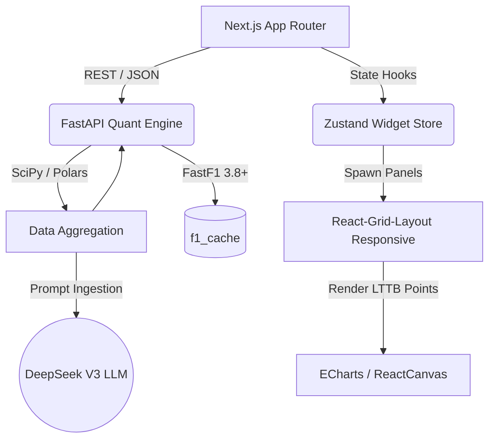

<div align="center">

# `[ F1 TERMINAL ]`

```text
  ___ ___   _____ ___ ___ __  __ ___ _  _  _   _    
 | __<  /  |_   _| __| _ \  \/  |_ _| \| |/ \ | |   
 | _|| |     | | | _||   / |\/| || || .` / _ \| |__ 
 |_| |_|     |_| |___|_|_\_|  |_|___|_|\_/_/ \_\____|
```

**The Bloomberg Terminal for Formula 1.**  
*Quantitative, Keyboard-Driven, and Highly Precise.*

[](https://opensource.org/licenses/MIT)
[](https://www.python.org/downloads/)
[](https://nextjs.org/)
[](https://docs.fastf1.dev/)

[Architecture](#architecture) •
[Philosophy](#core-philosophy) •
[Command Matrix](#cli-command-matrix) •
[Quick Start](#quick-start) •
[Contributing](CONTRIBUTING.md)

</div>

---

## Core Philosophy

F1 Terminal is built for data engineers, race strategists, and hardcore quant analysts. We reject bloated UIs, meaningless pie charts, and interpolated inaccuracies.

1. **Strict Interpolation Rules**: We never directly compare the Time arrays of two cars. F1 Terminal relies on rigorous `scipy.interpolate` transformations to project multi-driver Telemetry onto a synthesized Distance Axis (step=2m) before computing performance Delta ($\Delta T$).
2. **Keyboard-First Design**: Point-and-click navigation is too slow for racing. We use a monolithic CLI router. Type `TEL 2024 BAH Q VER` to instantly spawn an isolated telemetry micro-service widget. 
3. **No Unwarranted Resampling**: G-Force derivates and Cornering Speed minimums are generated from pristine, unpadded 10Hz raw strings. Wait until the math is complete before dropping frame resolution for frontend rendering using Largest Triangle Three Buckets (LTTB).
4. **Zustand Data Streaming**: The frontend holds zero global data states. Each CLI command spawns an encapsulated asynchronous React DOM overlay that survives purely until closed.

---

## Technical Features

* **Universal Data Lake (`-r` modifier)**: Bypasses charts to render arbitrary JSON outputs (Weather, Race Control, Telemetry Vectors) into a high-density Bloomberg-style Terminal Grid.
* **Global Macro Ticker**: A React component locked to the DOM root, running a synchronized 1000ms polling loop against FastF1's UTC event schedules, displaying live track temperature feeds.
* **Kinematic G-Force Engine**: Extrapolates 3D physical coordinate arrays into Longitudinal, Lateral, and Vertical G-Forces using 1st and 2nd derivatives of velocity and rotational matrices.

---

## CLI Command Matrix

Our Terminal is driven by syntax. Enter these top-level instructions into the command prompt:

| Command Syntax | Parameters | Vector Description | Visual Widget |
| :--- | :--- | :--- | :--- |
| `TEL` | `<YR> <GP> <SESS> <DRV1> [DRV2]` | **High-Frequency Telemetry Comparison**. Plots Speed, Throttle, Brake, nGear, and $\Delta T$ differences mapped to distance. Computes 3D G-Forces. *(Supports `-r / --raw`)* | 5-Grid Linked Canvas / DataGrid |
| `MAP SPD` | `<YR> <GP> <SESS> <DRV>` | **Geospatial Speed Map**. GPS projection of the driver's fastest lap. Color-mapped to cornering apex thresholds. | Gradient Scatter Heatmap |
| `MAP GEAR` | `<YR> <GP> <SESS> <DRV>` | **Geospatial Gear Map**. GPS projection indicating strict transmission gear utilization curves. | Piecewise Segments |
| `STINT` | `<YR> <GP> <SESS> <DRV>` | **Pace / Degradation Modeling**. Discards Out/In/SC laps and applies Linear Regression to predict compounding tyre slope decay. | Time Series Scatter |
| `DOM` | `<YR> <GP> <SESS> <DRV1> <DRV2>` | **Mini-Sector Dominance**. Dynamically splits track spans into 25 partitions, calculating local average speed superiority vector mapping. | Binary Scatter Map |
| `WEATHER`| `<YR> <GP> <SESS>` | **Meteorology Logs**. Outputs chronological track-temp, air-temp, and humidity vectors. *(Native Raw)* | DataGrid JSON Table |
| `MSG` | `<YR> <GP> <SESS>` | **FIA Race Control**. Extracts raw marshal sector flags, penalties, and track status deltas. *(Native Raw)* | DataGrid JSON Table |
| `INSIGHT` | `<YR> <GP> <SESS> <DRV1> <DRV2>` | **AI Strategy Desk**. Binds extracted dimensions into JSON and feeds DeepSeek V3 to output a synthesized hedge-fund-style race document. | LLM Markdown Terminal |

---

## Architecture

F1 Terminal relies on a completely decoupled **Monorepo Structure** bridging hardcore data science paradigms with responsive web UI handling. 



- **Frontend (`/frontend`)**: Next.js 16 (Turbopack), React Grid Layout (WidthProvider Responsive), Zustand, Apache ECharts, Tailwind CSS.  
- **Backend (`/backend`)**: Python 3.10+, FastAPI, FastF1 3.8+, Polars, SciPy, NumPy, Pydantic.

---

## Quick Start

### 1. Requirements
Ensure you have **Node.js 20+** and **Python 3.10+** (or Docker).

### 2. Production Deployment (Docker + 1Panel)

F1 Terminal is strictly designed for **Localhost Port Binding** to prevent unauthorized bare-IP API scraping. 

1. **Configure Environment:**
   Edit `.env.production` and point the `NEXT_PUBLIC_API_URL` to your future backend subdomain (e.g., `https://api.f1.yourdomain.com/api/v1`).
2. **Build and Spin Up:**
   ```bash
   docker-compose --env-file .env.production up -d --build
   ```
   *Note: Ports `35000` (Frontend) and `38000` (Backend) are bound locally and cannot be accessed from the public internet.*
3. **1Panel / Nginx Reverse Proxy Setup:**
   Head to your 1Panel Dashboard -> **Websites** -> **Create Website** -> **Reverse Proxy**:
   - **Frontend Proxy**: 
     - Domain: `f1.yourdomain.com`
     - Proxy Host: `http://127.0.0.1:35000`
   - **Backend API Proxy**: 
     - Domain: `api.f1.yourdomain.com`
     - Proxy Host: `http://127.0.0.1:38000`
   - **Security**: Navigate to the **HTTPS** tab for both sites, request a Let's Encrypt certificate, and toggle **Force HTTPS**.

### 3. Local Monorepo Startup
Spin up the Quant Engine Backend:
```bash
cd backend
python -m venv venv
source venv/bin/activate  # (Windows: venv\Scripts\activate)
pip install -r requirements.txt
uvicorn main:app --reload
```

Spin up the Terminal UI Frontend:
```bash
cd frontend
npm install
npm run dev
```

Point your browser to `http://localhost:3000`.  
Hit the Terminal input, type `HELP`, and press `[ ENTER ]`. Welcome to the Pit Wall.
